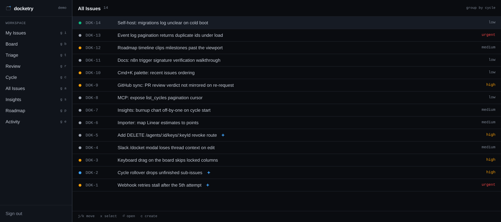
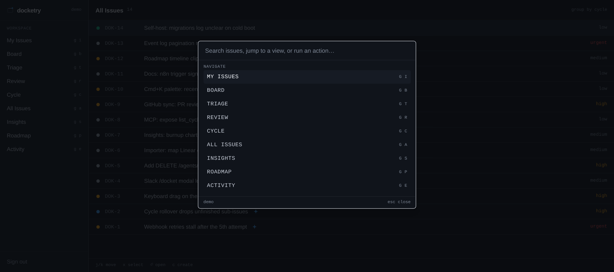
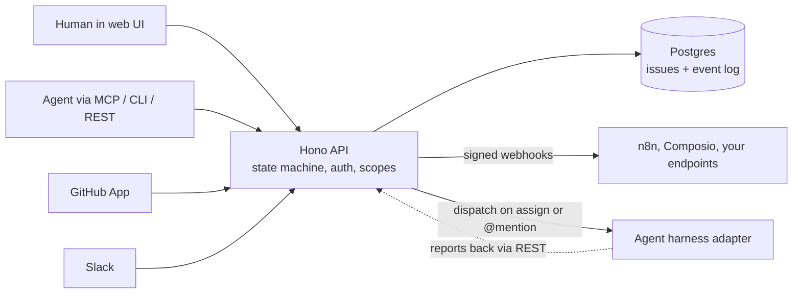

<p align="center">
  <picture>
    <source media="(prefers-color-scheme: dark)" srcset="./assets/brand/lockup-dark.svg">
    
  </picture>
</p>

<p align="center"><strong>A self-hostable, MIT-licensed issue tracker where humans and AI agents work the same board.</strong></p>

<p align="center">
  <a href="./LICENSE-MIT">MIT</a> ·
  <a href="./docs/deploy.md">Self-host</a> ·
  <a href="./docs/agents.md">Agents</a> ·
  <a href="./ROADMAP.md">Roadmap</a> ·
  <a href="./CHANGELOG.md">Changelog</a>
</p>



<sub>Real capture of the running app with demo data (`apps/web`, dark theme). The blue star marks issues assigned to an agent.</sub>

## What it is

docketry is a Linear-style tracker you run yourself. Issues move through one state machine
(`triage`, `backlog`, `todo`, `in_progress`, `in_review`, `done`, plus `canceled` and `duplicate`)
whether a person or an agent moves them, and every change is written to an append-only event log with
the actor's identity.

- **Keyboard-first web app.** Issue list, kanban board, triage inbox, review queue, cycles, insights,
  and a roadmap timeline. `Cmd+K` palette, `j`/`k` movement, `g` plus a letter to jump, `?` for the keymap.
- **Agents as actors.** Register an agent, give it a scoped `dok_agt_*` key, assign it issues, and its
  actions are attributed to it by name.
- **Three ways in for agents.** An [MCP server](./docs/mcp.md) (stdio and Streamable HTTP), the
  [`docketry` CLI](./docs/agents.md) with `--json` output and stable exit codes, and the REST API with
  an OpenAPI document at `GET /openapi.json`.
- **Dispatch.** Assigning an issue to an agent or `@mention`ing it creates a dispatch and calls that
  agent's harness adapter (local harnesses, or a signed webhook). See [docs/adapters.md](./docs/adapters.md).
- **Signed webhooks out.** HMAC-SHA256 deliveries with retries and a delivery log
  ([docs/webhooks.md](./docs/webhooks.md)).
- **Integrations.** GitHub App sync, Slack intake and thread mirroring, an n8n node, a Composio
  toolkit, and importers for GitHub issues and Linear CSV.

<p align="center">
  
</p>

## Quick start (development)

Requires Node.js, pnpm 10 and Docker.

```bash
git clone https://github.com/duketopceo/docketry
cd docketry
pnpm install
cp .env.example .env
docker compose up -d   # Postgres on :5432, Redis on :6380
pnpm dev               # web on :3100, API on :4000
```

Open `http://localhost:3100`, bootstrap the first workspace, and you have a board.

## Self-host

From clone to a working board in under 10 minutes:

```bash
git clone https://github.com/duketopceo/docketry && cd docketry
cat > .env <<EOF2
POSTGRES_PASSWORD=$(openssl rand -hex 16)
JWT_SECRET=$(openssl rand -hex 32)
EOF2
docker compose -f docker-compose.selfhost.yml up -d
# http://localhost:3100 -> /bootstrap -> board
```

Env reference, Cloudflare Tunnel, Railway, upgrades and backups: [docs/deploy.md](./docs/deploy.md).

## Connect an agent

```bash
# 1. a signed-in human registers an agent and mints a key (shown once)
#    POST /v1/workspaces/:ws/agents          then   POST /v1/workspaces/:ws/agents/:id/keys
# 2. the agent works the board
export DOCKETRY_API_URL=http://localhost:4000 DOCKETRY_TOKEN=dok_agt_... DOCKETRY_WORKSPACE=acme
docketry ready --json      # what can I claim?
docketry claim ENG-42      # assign to me, move to in_progress
docketry comment ENG-42 "reproduced; fix in progress"
docketry done ENG-42       # in_review, then done
```

MCP clients use the same key. Config for Claude Code, Cursor, Codex and opencode is in
[docs/agents.md](./docs/agents.md). Board rules for agents are in [SKILL.md](./SKILL.md).

## How it works



Everything goes through the API, so the same auth, scope and state-machine rules apply to every
client. Details of the repository layout are in [AGENTS.md](./AGENTS.md).

## Status

v1.0.0 shipped 2026-10-10 ([CHANGELOG](./CHANGELOG.md)). Known gaps include push-based realtime
(the event stream polls once a second), an agent key revoke route, and a CI workflow. The plan
with difficulty ratings is in [ROADMAP.md](./ROADMAP.md); research on the competing tools is in
[docs/research/2026-10-10-landscape.md](./docs/research/2026-10-10-landscape.md).

## Docs

[AGENTS.md](./AGENTS.md) · [DESIGN.md](./DESIGN.md) · [docs/agents.md](./docs/agents.md) ·
[docs/mcp.md](./docs/mcp.md) · [docs/adapters.md](./docs/adapters.md) ·
[docs/webhooks.md](./docs/webhooks.md) · [docs/deploy.md](./docs/deploy.md) ·
[docs/security-review.md](./docs/security-review.md) · [plans/](./plans/)

## Contributing

See [CONTRIBUTING.md](./CONTRIBUTING.md) for setup, the local `pnpm check` gate and conventions.
Security reports: [SECURITY.md](./SECURITY.md).

## Licence

[MIT](./LICENSE-MIT). Plane, Huly and Tegon are AGPL or EPL and are not copied from.
