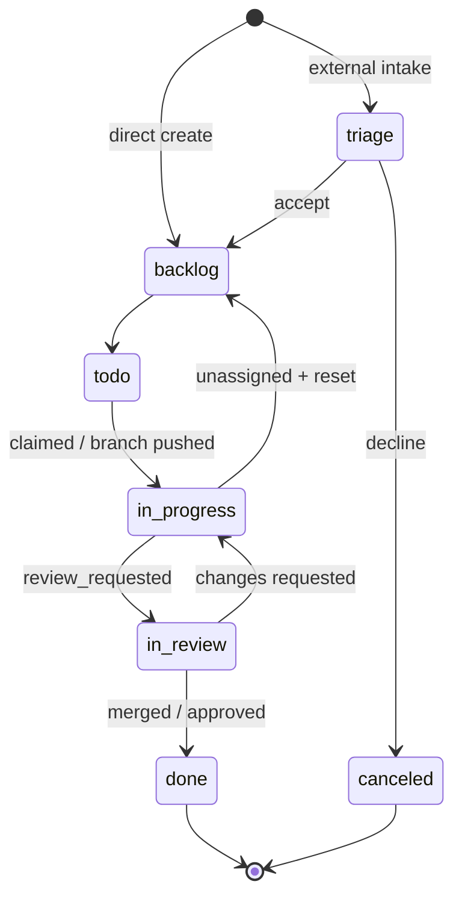
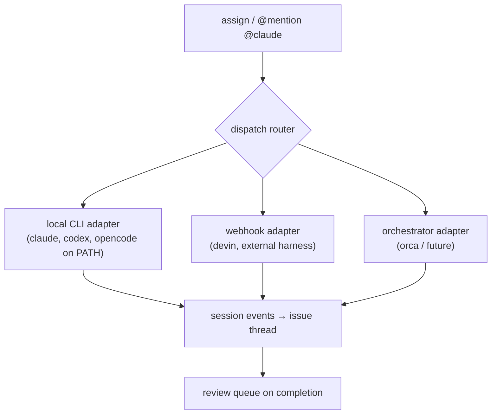
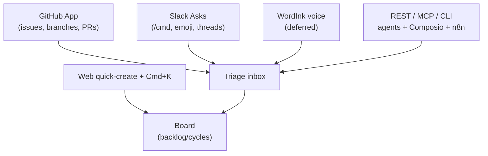

# docketry - Plan

## Goal Capsule

- **Objective:** Luke runs docketry as the system of record across his repos, with humans and AI agents working the same board — an agent can complete a full claim → implement → PR → Done loop without a human touching the UI. Later, a work team self-hosts it to replace paid Linear seats.
- **Means:** Open-source (MIT), self-hostable, all-TypeScript monorepo; `docker compose up` is the canonical deploy.
- **Product authority:** this document is the product contract for the whole product, milestone-sequenced. Planning agents implement against the Requirements; they do not invent product behavior.
- **Open blockers:** none at the product level. Outstanding Questions lists planning-level forks.

---

## Product Contract

### Summary

docketry is a self-hostable, MIT-licensed issue tracker built for the case where agents are first-class actors: assignable, mentionable, API- and MCP-native, and dispatchable to any registered harness. It pairs a Linear-class operator interface (density, keyboard-first, `Cmd+K`) with the integrations surface that makes the tracker reachable from wherever agents already are — GitHub App, Slack, Composio toolkit, n8n node, public webhooks, CLI — and routes work out to harnesses via `@`-mention dispatch.

### Problem Frame

Linear's free tier caps at 250 issues and 2 teams; paid tiers run $8–16/seat. GitHub Projects' milestones cover ordering but not workflow. Work wants off the paid tool, and Luke wants one of his own — that is an honest driver, and the doc treats it as such rather than manufacturing an efficiency crisis.

The sharper gap appeared in competitive research: the agent-native tracker quadrant is being colonized right now — Agentra (OSS, polymorphic human/agent assignees), Hiveship (SaaS, review-queue model), Tembo (SaaS, `@`-mention → PR), Epiq and git-issues (git-native local CLIs), and Linear itself now ships an official MCP server plus native `@Cursor` dispatch. What remains unoccupied is **self-hosted + MIT + harness-agnostic dispatch + integrations breadth** — a tracker reachable from wherever agents already live, that routes work to whatever harness you tag, without renting the capability per seat.

### Key Decisions

- **Standalone system of record** (session-settled: user-directed — chosen over a GitHub-synced layer: clean semantics, own issue keys, no permanent sync-conflict surface; GitHub is a feed, not the substrate).
- **MIT + clean-room** (session-settled: user-approved — recommended permissive over AGPL: adoption friction is real for AGPL, and AGPL contamination is irreversible. Plane (AGPL-3.0), Tegon (AGPL-3.0, archived), and Huly (EPL-2.0) are study material only; patterns are free, code is not. Governs R25).
- **All-TypeScript monorepo** (session-settled: user-approved — over a FastAPI backend and over Rust: one contributor pool, and the SDKs that matter — octokit, Slack Bolt, Composio, MCP, n8n nodes — are TypeScript-first or TS-only. Rust is deferred to a possible future compiled sync/WASM component only; see Scope Boundaries).
- **Agents are first-class actors AND dispatch targets** (user-directed — selected Agent API + MCP intake plus `@`-mention dispatch: the tracker is both worked by agents and routes work to them. Governs R13, R14, R15, R16, R17).
- **Design contract is authored, not borrowed** — `DESIGN.md` is written in the VoltAgent design-md format (MIT) with docketry's own tokens; Linear's token values are not copied (trade-dress safety is the same clean-room rule as code). The brand concept is "the silver lining": silver hairlines as structural signature that brighten on failure states, and a four-point sparkle used only as agent provenance. Governs R12.
- **Repo conventions** — milestones versioned (`v0.x`/`v1.0`), issues titled conventional-commit style, `work-order` label for plan-tracked items, `afk`/`hitl` labels mark grabbable slices.

### Actors

- A1. **Human operator** — Luke first, work-team members later. Works the board, triages, reviews agent output.
- A2. **Agent actor** — a registered harness identity (`@claude`, `@cursor`, `@opencode`, `@devin`, internal agents like `hermes`). Files, claims, comments, dispatches, completes work. Actions are attributed and sparkle-marked.
- A3. **Reporter** — a person whose intake action (Slack message, GitHub issue) creates an item without touching the UI.
- A4. **Integration surfaces** — GitHub App, Slack workspace, Composio catalog, n8n, arbitrary webhook consumers, MCP clients, CLI users.

### Requirements

**Core tracking**

- R1. Issues carry human-readable keys (`<TEAM>-<n>`) alongside internal IDs; keys are stable, linkable, and safe to type in commit messages and branch names.
- R2. Issue lifecycle is a fixed state machine — `triage → backlog → todo → in_progress → in_review → done`, plus `canceled` and `duplicate` terminal states — identical for human and agent actors.

- R3. Issues support sub-issues, labels, priorities (urgent/high/medium/low/none), estimates, due dates, and an assignee that may be human or agent.
- R4. Cycles are time-boxed iterations; at cycle boundary, unfinished issues roll to the next cycle or back to backlog per team setting, with an audit event per issue.
- R5. All external intake (GitHub, Slack, API-created, voice) lands in a triage lane as `triage` state until accepted or declined; direct in-app creation may bypass triage.
- R6. Every mutation writes an append-only event record with actor identity (human or agent), timestamp, and before/after — this powers the activity feed, replay, and provenance marks.

**Interface**

- R7. Keyboard-first: `Cmd+K` palette (recent, navigation, page actions, fuzzy search, help), `j`/`k` list nav, `g <letter>` jumps, `x` multi-select with bulk bar, `c` create, `e` edit, `Cmd+Enter` submit, `Esc` close, `?` shortcut map. Every interactive element reachable by keyboard.
- R8. Views: grouped list, drag-drop board, My Issues, Triage, Cycle, Project, Review queue. Default landing is the actionable view sorted by severity — never an unfiltered "all issues" dump.
- R9. Optimistic UI on every mutation with rollback on failure; skeletons match final layout; every error state shows cause plus a recommended action; every empty state shows what appears here, why it's empty, and what to do next.
- R10. Performance budgets: LCP < 1.5s, INP < 200ms, CLS < 0.05, initial bundle < 200 kb gzipped, virtualized lists beyond 100 rows.
- R11. Accessibility floor: axe-core clean in CI, visible focus, 4.5:1 body contrast, `prefers-reduced-motion` respected.
- R12. Dark-first operator theme per `DESIGN.md`; light theme as supported secondary. The silver lining is functional — it brightens on blocked/error/attention states that carry a recommended action; the sparkle renders only on agent-acted items.

**Agent surface**

- R13. Agents are first-class identities: assignable, `@`-mentionable, issued scoped API keys, and attributed in the event log under their own name — an agent's actions render with the sparkle provenance mark.
- R14. An MCP server exposes the issue/workflow tool surface (list, get, create, update, comment, claim, ready) so any MCP client can work the board.
- R15. A public REST API with a published OpenAPI spec covers every UI capability; a CLI (`docketry` / `dok`) covers claim/next/done/search/create/comment with machine-readable `--format json` output.
- R16. Assigning an issue to an agent identity or `@`-mentioning it in a comment routes the issue to that harness via a per-harness dispatch adapter; the dispatch result (started, failed, session link, PR link) posts back to the issue thread.

- R17. Agent-completed work lands in a review queue with the session activity log and linked PR; human approve/send-back is the completion path.

**Intake and integrations**

- R18. A GitHub App connects repos: branch names matching `<KEY>-slug` drive `in_progress`; `review_requested` drives `in_review`; merged PRs drive `done` with the PR linked; issues opened on connected repos land in triage.
- R19. Slack intake: a slash command modal and a reaction-emoji shortcut create triage items from thread context; issue status and comments mirror back to the Slack thread bidirectionally.
- R20. Outbound webhooks emit signed events for issue and cycle mutations — the substrate for n8n, Composio, and arbitrary consumers.

- R21. A published Composio toolkit and an n8n community node make docketry reachable from external agent platforms without custom glue.
- R22. Importers: a one-way GitHub Issues importer and a Linear CSV importer.

**Operations**

- R23. `docker compose up` is the canonical deploy: documented env, migrations on boot, a single host suffices; must run on a commodity VPS, homelab, or Railway-class platform.
- R24. Every entity is workspace-scoped; all queries carry the workspace boundary even when v1 runs a single workspace — tenant isolation is a structural invariant, not a feature flag.
- R25. The repo and all shipped code are MIT; no code, schema, or design-token copying from AGPL/EPL sources (Plane, Tegon, Huly) or from Linear's proprietary assets.

### Key Flows

- F1. Agent dispatch loop
  - **Trigger:** Human assigns an issue to `@claude` (or comments `@opencode take this`).
  - **Actors:** A1, A2
  - **Steps:** Dispatch router resolves the identity → adapter launches session with issue context → progress events stream to the issue thread → agent opens a linked PR → issue lands in review queue.
  - **Outcome:** Human approves → `done`; send-back → `in_progress` with feedback comment.
  - **Covered by:** R13, R16, R17, R6
- F2. Slack intake to done
  - **Trigger:** Reporter reacts `:ticket:` on a thread (or runs `/docket`).
  - **Actors:** A3, A1
  - **Steps:** Intake modal captures title/urgency → item lands in triage → human accepts → issue created and linked → status transitions and replies mirror to the thread → `done` posts a resolution reply.
  - **Outcome:** Reporter never leaves Slack; the board stays the system of record.
  - **Covered by:** R19, R5, R2
- F3. GitHub automation loop
  - **Trigger:** Push of a branch named `dok-42-fix-auth` (or PR opened).
  - **Actors:** A1 or A2, A4
  - **Steps:** Webhook parses key → `in_progress`; `review_requested` → `in_review`; `merged` → `done` with PR linked and cycle metrics updated.
  - **Outcome:** Board hygiene happens without human bookkeeping.
  - **Covered by:** R18, R2, R6
- F4. Autonomous agent board work
  - **Trigger:** An agent with API credentials wants work.
  - **Actors:** A2
  - **Steps:** Agent calls `ready`/`next` via MCP or CLI → claims highest-priority unblocked issue → works → comments progress → marks done → audit log attributes every step to the agent identity.
  - **Outcome:** A human reviewing the board sees the agent's trail with sparkle provenance.
  - **Covered by:** R13, R14, R15, R6
- F5. Cycle rollover
  - **Trigger:** Cycle end timestamp reached.
  - **Actors:** none (scheduled job)
  - **Steps:** For each unfinished issue in the cycle: move to next active cycle or backlog per team setting; write an audit event; recompute velocity.
  - **Outcome:** New cycle opens clean; no manual grooming ritual.
  - **Covered by:** R4, R6

### Acceptance Examples

- AE1. Covers R4 — **Given** an active cycle ends with three unfinished issues, **when** the rollover job runs, **then** each issue moves per the team setting and carries an audit event naming the rollover as its actor.
- AE2. Covers R13, R16 — **Given** `@opencode` is a registered agent identity, **when** a human comments `@opencode take this`, **then** the dispatch router invokes the opencode adapter and the thread records `claimed` or `dispatch_failed` with a plain-English reason — never silent.
- AE3. Covers R9, R12 — **Given** the API is unreachable, **when** the list view fails to load, **then** the error state shows the likely cause and a retry action, and the panel renders the brightened silver lining — the failure state is where the lining earns its name.
- AE4. Covers R5, R18 — **Given** a stranger opens an issue on a connected GitHub repo, **when** the webhook fires, **then** the item appears in triage tagged with source `github` and does not enter backlog until accepted.
- AE5. Covers R15 — **Given** a fresh CLI install, **when** an agent runs `dok ready --format json`, **then** it receives unblocked issues ordered by priority with only the fields agents need.

### Success Criteria

- Luke daily-drives docketry for his own repos — files, triages, and closes without opening Linear — by the end of the GitHub-automation milestone.
- An agent completes claim → implement → PR → `done` unattended at least once via dispatch, with a reviewable trail.
- The v0.1 UI passes the perf budgets (R10) and a11y floor (R11) in CI gates.
- A stranger can go from `docker compose up` to a working board in under 10 minutes using only the README.
- Every issue filed by an agent renders sparkle provenance; a skim of any list answers "how much of this board did machines do?"

### Scope Boundaries

**Deferred for later**

- Slack intake + mirroring, Composio toolkit, n8n node — integration-breadth milestone, not v0.1.
- WordInk voice intake (dictate → structured ticket with technical vocabulary) — post-launch wedge.
- GitHub bulk importer, Linear CSV importer, roadmaps/Gantt, Insights analytics (cycle time, burnup, SLA), multi-workspace orgs, SSO/SCIM, guest seats.
- Mobile-grade responsiveness — desktop-first operator tool; a native mobile app is not planned.
- Rust — reserved for a possible future compiled sync engine (WASM) or static CLI; not the product stack.

**Outside this product's identity**

- Docs/wiki, built-in chat, video calls, CRM, time tracking, HR — the Huly all-in-one surface is explicitly not this product.
- A GitHub-mirror tool — GitHub feeds docketry; it is not the substrate.
- A bundled coding agent — docketry routes to harnesses; it does not ship its own model runtime.
- Hosted SaaS — self-hostable open source only; a managed offering is a separate business decision, not this repo.

### Dependencies / Assumptions

- GitHub App and Slack app registrations need Luke's org accounts; the apps are created during their milestones.
- A Composio catalog listing requires their submission/acceptance process — assume feasible, verify during that milestone.
- Dispatch adapters are per-harness plugins; each harness interface (local CLI, webhooks, orchestrator) differs — the adapter boundary absorbs that.
- Postgres 17+, Redis 7+, Node 22+; aarch64-friendly images required (primary dev host is Apple silicon Linux).
- Org standards that bind this product: tenant isolation on every query (R24), append-only audit log (R6), webhook signature verification (R20), no secrets in repo, conventional-commit titles, `work-order` issue tracking.

### Outstanding Questions

- ORM choice (Drizzle vs Prisma), realtime transport (SSE vs WebSocket), exact harness set for dispatch adapters in the first dispatch milestone — **Deferred to Planning**.
- Team-key format and whether personal workspaces default to `DOK` — **Deferred to Planning**.
- Voice-intake post-processing pipeline shape (transcript → ticket standard) — deferred with the WordInk feature itself.

### Sources / Research

- Competitive field: Agentra (`agentra-ai/agentra`, polymorphic human/agent assignee model — adopt the *pattern*), Hiveship (hiveship.app — review-queue model, flat-pricing attack on per-seat), Tembo (tembo.io — `@`-mention → PR dispatch loop), Epiq (git-native board + MCP + shipped SKILL.md pattern), git-issues (`steviee/git-issues` — `claim`/`next`/`done` agent verbs), `ohnotnow/agent-issue-tracker` and `sortie-ai/sortie` (prior art), Linear's own MCP server and `@Cursor` dispatch (the incumbent baseline).
- License findings (verified): Plane AGPL-3.0-only; Tegon AGPL-3.0 and **archived** (RedPlanetHQ/tegon); Huly EPL-2.0; cmdk/shadcn-ui/Radix/dnd-kit MIT; VoltAgent/awesome-design-md MIT.
- Org standards loaded: `luke-agents` AGENTS.md + UX_FIRST.md + INIT_PROTOCOL.md; repo conventions from kurultai/Pace-Server/orchestral (milestone naming, `work-order` label, conventional-commit issue titles).
- Composio platform: sessions model (`composio.create(user_id)` + meta-tools) — the toolkit publication target for external agents.
